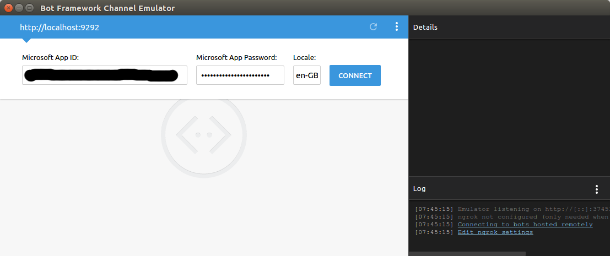
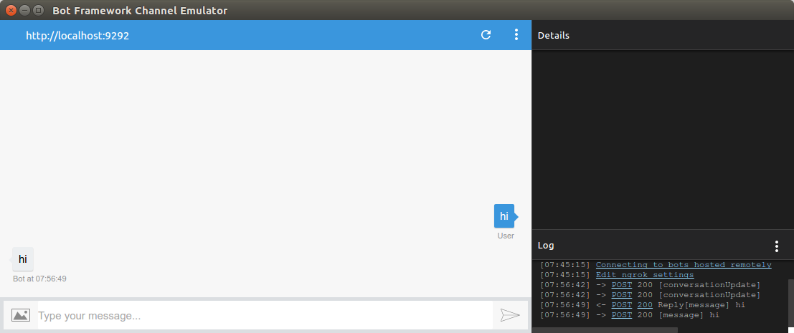

# BotFramework

Ruby client to make statefull bots using microsoft botframework . Currently under development , don't try this in under production till v1.0

## Installation

Add this line to your application's Gemfile:

```ruby
gem 'bot_framework'
```

And then execute:

    $ bundle

Or install it yourself as:

    $ gem install bot_framework

## Usage

Simple echo bot
```ruby
BotFramework.configure do |connector|
  connector.app_id = ENV['MICROSOFT_APP_ID']
  connector.app_secret = ENV['MICROSOFT_APP_SECRET']
end

BotFramework::Bot.on :activity do |activity|
  # Activity.id , identifier of the activity
  # activity.timestamp
  # activity.channel_id
  # activity.from, sender 
  # activity.conversation
  # activity.topic_name
  # activity.locale
  # activity.text
  # and so on

  reply(activity,activity.text)
end

```

## Emulator

You can use botframework emulator for testing your bot in local system.
* Download https://github.com/Microsoft/BotFramework-Emulator
* run `rackup` in the bot directory
* Give url(default url for rackup is `localhost:9292`) and botframework credentials in the emulator




## Development

After checking out the repo, run `bin/setup` to install dependencies. Then, run `rake spec` to run the tests. You can also run `bin/console` for an interactive prompt that will allow you to experiment.

To install this gem onto your local machine, run `bundle exec rake install`. To release a new version, update the version number in `version.rb`, and then run `bundle exec rake release`, which will create a git tag for the version, push git commits and tags, and push the `.gem` file to [rubygems.org](https://rubygems.org).

## Contributing

Bug reports and pull requests are welcome on GitHub at https://github.com/tachyons/bot_framework. This project is intended to be a safe, welcoming space for collaboration, and contributors are expected to adhere to the [Contributor Covenant](http://contributor-covenant.org) code of conduct.


## License

The gem is available as open source under the terms of the [MIT License](http://opensource.org/licenses/MIT).

